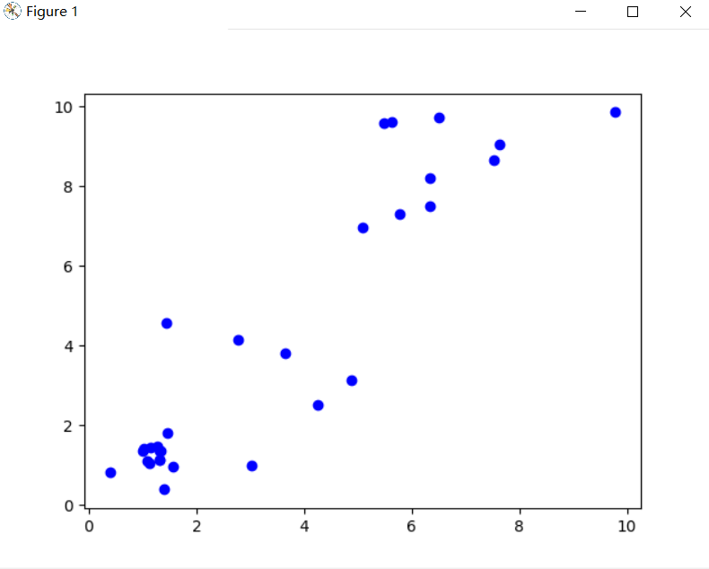
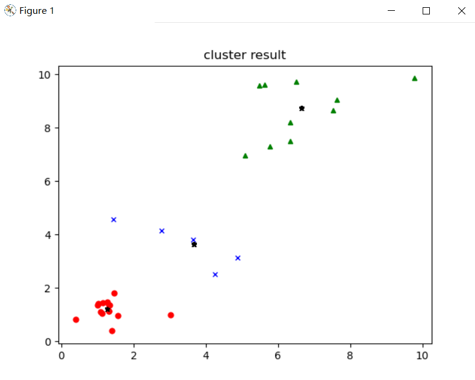

# Links 

1. 📚  [**Theoretical introduction 理论介绍**](https://blog.csdn.net/coolyuan/article/details/107515224)
2. 📦  [**All Resources 资源链接**](https://pan.baidu.com/s/1q2nQRdmG9GfUPQGY3ITL0A?pwd=4s6m)
3. 👤  [ **My CSDN homepage 我的CSDN主页**](https://blog.csdn.net/coolyuan)

**如果你觉得这个项目对你有帮助，请给我一个 Star或者在CSDN点个赞，这将是对我最大的鼓励，也能让更多有需要的人看见！谢谢！~🌹**
# Cluster Results

# Image Segmentation

